# Diagram Architektury UI - Moduł Autentykacji i Generowania Fiszek

## Analiza Architektury

<architecture_analysis>

### 1. Komponenty wymienione w dokumentacji i istniejące w projekcie

#### Istniejące komponenty:
- **Layout.astro** - główny layout aplikacji z integracją AppShell
- **AppShell.tsx** - wrapper zapewniający ThemeProvider i Header
- **Header.tsx** - nagłówek z nawigacją i przyciskiem zmiany motywu
- **FlashcardGenerationView.tsx** - widok generowania fiszek przez AI
- **FlashcardList.tsx** - lista fiszek (wygenerowanych lub zapisanych)
- **FlashcardListItem.tsx** - pojedynczy element fiszki
- **BulkSaveButton.tsx** - przycisk do masowego zapisywania fiszek
- **TextInputArea.tsx** - pole do wprowadzania tekstu dla AI
- **ThemeProvider.tsx** - provider motywu ciemnego/jasnego
- **ThemeToggleButton.tsx** - przycisk przełączania motywu
- **ui/button.tsx** - bazowy komponent przycisku z shadcn/ui
- **Welcome.astro** - komponent powitalny na stronie głównej

#### Nowe strony Astro (do implementacji):
- **login.astro** - strona logowania z formularzem LoginForm
- **register.astro** - strona rejestracji z formularzem RegisterForm
- **password-reset.astro** - strona resetowania hasła
- **update-password.astro** - strona aktualizacji hasła po resecie

#### Nowe komponenty React Auth (do implementacji):
- **auth/LoginForm.tsx** - formularz logowania z walidacją
- **auth/RegisterForm.tsx** - formularz rejestracji z walidacją
- **auth/PasswordResetForm.tsx** - formularz resetowania hasła
- **auth/UpdatePasswordForm.tsx** - formularz ustawiania nowego hasła

#### Nowe API endpointy (do implementacji):
- **api/auth/callback.ts** - finalizacja procesu autentykacji OAuth/email
- **api/auth/signout.ts** - endpoint wylogowania

#### Middleware i Database:
- **middleware/index.ts** - zarządzanie sesją i ochrona tras (wymaga rozbudowy)
- **db/supabase.client.ts** - klient Supabase dla aplikacji

### 2. Główne strony i ich komponenty

#### Strona główna (/)
- Renderuje: Layout.astro → AppShell.tsx → Header.tsx + Welcome.astro
- Dostępna dla: wszystkich użytkowników (niezalogowanych i zalogowanych)

#### Strona logowania (/login)
- Renderuje: Layout.astro → AppShell.tsx → Header.tsx + LoginForm.tsx
- Dostępna dla: niezalogowanych użytkowników
- Przekierowanie: zalogowani użytkownicy → /generate

#### Strona rejestracji (/register)
- Renderuje: Layout.astro → AppShell.tsx → Header.tsx + RegisterForm.tsx
- Dostępna dla: niezalogowanych użytkowników
- Przekierowanie: zalogowani użytkownicy → /generate

#### Strona generowania (/generate)
- Renderuje: Layout.astro → AppShell.tsx → Header.tsx + FlashcardGenerationView.tsx
- Dostępna dla: tylko zalogowanych użytkowników
- Przekierowanie: niezalogowani użytkownicy → /login

#### Strona resetowania hasła (/password-reset)
- Renderuje: Layout.astro → AppShell.tsx → Header.tsx + PasswordResetForm.tsx
- Dostępna dla: niezalogowanych użytkowników

#### Strona aktualizacji hasła (/update-password)
- Renderuje: Layout.astro → AppShell.tsx → Header.tsx + UpdatePasswordForm.tsx
- Dostępna z: linku email Supabase

### 3. Przepływ danych między komponentami

**Przepływ sesji:**
1. **Middleware** → pobiera sesję z Supabase → zapisuje w `Astro.locals.session`
2. **Layout.astro** → odczytuje `Astro.locals.session` → przekazuje do `AppShell.tsx`
3. **AppShell.tsx** → przekazuje sesję do `Header.tsx`
4. **Header.tsx** → wyświetla przyciski logowania/wylogowania na podstawie sesji

**Przepływ autentykacji:**
1. **LoginForm.tsx/RegisterForm.tsx** → `supabase.auth.signInWithPassword()` / `signUp()`
2. **Supabase** → tworzy sesję w ciasteczkach
3. **Middleware** → odczytuje sesję przy kolejnym żądaniu
4. **Przekierowanie** → użytkownik trafia do `/generate`

**Przepływ wylogowania:**
1. **Header.tsx** → przycisk "Wyloguj" → POST do `/api/auth/signout`
2. **API signout** → `supabase.auth.signOut()` → czyści sesję
3. **Przekierowanie** → użytkownik trafia do `/`

**Przepływ generowania fiszek:**
1. **TextInputArea.tsx** → użytkownik wprowadza tekst
2. **FlashcardGenerationView.tsx** → wywołuje hook `useGenerateFlashcards`
3. **useGenerateFlashcards** → POST do `/api/generations`
4. **API generations** → wywołuje OpenRouter/LLM → zwraca fiszki
5. **FlashcardList.tsx** → wyświetla wygenerowane fiszki
6. **BulkSaveButton.tsx** → zapisuje zaakceptowane fiszki do bazy

### 4. Opis funkcjonalności każdego komponentu

**Layout.astro**: Główny layout aplikacji, pobiera sesję użytkownika z middleware, zarządza meta tagami i strukturą HTML.

**AppShell.tsx**: Wrapper wszystkich stron, zapewnia kontekst motywu i renderuje nagłówek.

**Header.tsx**: Nawigacja aplikacji, wyświetla przyciski logowania/wylogowania w zależności od stanu sesji.

**LoginForm.tsx**: Interaktywny formularz logowania z walidacją po stronie klienta, komunikacją z Supabase Auth.

**RegisterForm.tsx**: Formularz rejestracji z walidacją hasła i formatu email, obsługa błędów z Supabase.

**PasswordResetForm.tsx**: Formularz z polem email do inicjacji procesu resetowania hasła.

**UpdatePasswordForm.tsx**: Formularz do ustawienia nowego hasła po kliknięciu linku z emaila.

**FlashcardGenerationView.tsx**: Główny widok generowania fiszek, orkiestruje komponenty TextInputArea, FlashcardList, BulkSaveButton.

**middleware/index.ts**: Centralny punkt zarządzania sesją, ochrona tras chrononych, przekierowania użytkowników.

**supabase.client.ts**: Inicjalizacja klienta Supabase do komunikacji z backendem.

</architecture_analysis>

## Diagram Mermaid

```mermaid
flowchart TD
    subgraph "Warstwa Infrastruktury"
        MW["Middleware<br/>(index.ts)<br/>⚙️ Zarządzanie sesją<br/>🔒 Ochrona tras"]
        SUP["Supabase Client<br/>(supabase.client.ts)<br/>🔌 Połączenie z bazą"]
        SUPAUTH["Supabase Auth<br/>🔐 System autentykacji"]
    end

    subgraph "Layout i Shell"
        LAY["Layout.astro<br/>📄 Główny layout<br/>✨ Pobiera sesję"]
        APP["AppShell.tsx<br/>🎨 Theme Provider<br/>📦 Wrapper aplikacji"]
        HEAD["Header.tsx<br/>🧭 Nawigacja<br/>🔄 ZAKTUALIZOWANY<br/>Przyciski auth"]
    end

    subgraph "Strony Publiczne - Astro"
        IDX["index.astro<br/>🏠 Strona główna"]
        LOG["login.astro<br/>🆕 NOWA<br/>🔑 Strona logowania"]
        REG["register.astro<br/>🆕 NOWA<br/>📝 Strona rejestracji"]
        PWDR["password-reset.astro<br/>🆕 NOWA<br/>🔄 Reset hasła"]
        PWDU["update-password.astro<br/>🆕 NOWA<br/>🔑 Aktualizacja hasła"]
    end

    subgraph "Strony Chronione - Astro"
        GEN["generate.astro<br/>🔒 Chroniona<br/>✨ Generowanie fiszek"]
    end

    subgraph "Komponenty Autentykacji - React"
        LOGF["LoginForm.tsx<br/>🆕 NOWA<br/>📧 Email + Hasło<br/>✅ Walidacja client-side"]
        REGF["RegisterForm.tsx<br/>🆕 NOWA<br/>📧 Rejestracja<br/>✅ Walidacja złożoności hasła"]
        PWDRF["PasswordResetForm.tsx<br/>🆕 NOWA<br/>📧 Email do resetu"]
        PWDUF["UpdatePasswordForm.tsx<br/>🆕 NOWA<br/>🔑 Nowe hasło"]
    end

    subgraph "Komponenty Generowania - React"
        FGEN["FlashcardGenerationView.tsx<br/>🎯 Główny widok<br/>📝 Orkiestracja generowania"]
        TXT["TextInputArea.tsx<br/>⌨️ Pole tekstowe<br/>1000-10000 znaków"]
        FLIST["FlashcardList.tsx<br/>📋 Lista fiszek<br/>✅ Akceptacja/Edycja/Odrzucenie"]
        FITEM["FlashcardListItem.tsx<br/>🃏 Pojedyncza fiszka<br/>🎭 Przód/Tył"]
        BULK["BulkSaveButton.tsx<br/>💾 Masowy zapis"]
        HOOK["useGenerateFlashcards<br/>🪝 Hook generowania<br/>🔄 Stan + API call"]
    end

    subgraph "Komponenty Wspólne - React"
        WELC["Welcome.astro<br/>👋 Komponent powitalny"]
        THEME["ThemeProvider.tsx<br/>🎨 Zarządzanie motywem"]
        TOGGLE["ThemeToggleButton.tsx<br/>🌓 Przełącznik motywu"]
        BTN["ui/button.tsx<br/>🔘 Bazowy przycisk Shadcn"]
        SKEL["SkeletonLoader.tsx<br/>⏳ Wskaźnik ładowania"]
    end

    subgraph "API Endpoints"
        ACALL["api/auth/callback.ts<br/>🆕 NOWA<br/>✅ Finalizacja auth"]
        ASIGN["api/auth/signout.ts<br/>🆕 NOWA<br/>🚪 Wylogowanie"]
        AGEN["api/generations.ts<br/>🤖 Generowanie AI"]
        AFLASH["api/flashcards.ts<br/>💾 CRUD fiszek"]
    end

    %% Przepływ infrastruktury
    MW -->|"Dodaje sesję do<br/>Astro.locals"| LAY
    MW -->|"Korzysta z"| SUP
    SUP -.->|"Integracja"| SUPAUTH

    %% Przepływ layoutu
    LAY -->|"Renderuje"| APP
    APP -->|"Renderuje"| HEAD
    APP -->|"Renderuje sloty"| IDX
    APP -->|"Renderuje sloty"| LOG
    APP -->|"Renderuje sloty"| REG
    APP -->|"Renderuje sloty"| GEN
    APP -->|"Renderuje sloty"| PWDR
    APP -->|"Renderuje sloty"| PWDU

    %% Przepływ theme
    APP -->|"Dostarcza"| THEME
    HEAD -->|"Używa"| TOGGLE

    %% Przepływ stron publicznych
    IDX -->|"Renderuje"| WELC
    LOG -->|"Renderuje"| LOGF
    REG -->|"Renderuje"| REGF
    PWDR -->|"Renderuje"| PWDRF
    PWDU -->|"Renderuje"| PWDUF

    %% Przepływ autentykacji
    LOGF -.->|"supabase.auth<br/>.signInWithPassword()"| SUPAUTH
    REGF -.->|"supabase.auth<br/>.signUp()"| SUPAUTH
    PWDRF -.->|"supabase.auth<br/>.resetPasswordForEmail()"| SUPAUTH
    PWDUF -.->|"supabase.auth<br/>.updateUser()"| SUPAUTH
    HEAD -.->|"POST request"| ASIGN
    ASIGN -.->|"supabase.auth<br/>.signOut()"| SUPAUTH

    %% Przepływ callback
    SUPAUTH -.->|"Redirect po auth"| ACALL
    ACALL -->|"Tworzy sesję"| MW

    %% Przepływ strony chronionej
    GEN -->|"Renderuje"| FGEN
    FGEN -->|"Zawiera"| TXT
    FGEN -->|"Zawiera"| FLIST
    FGEN -->|"Zawiera"| BULK
    FGEN -->|"Używa"| HOOK
    FLIST -->|"Renderuje wiele"| FITEM

    %% Przepływ generowania fiszek
    TXT -->|"Tekst wejściowy"| HOOK
    HOOK -.->|"POST request"| AGEN
    AGEN -.->|"Wywołuje LLM"| SUPAUTH
    AGEN -->|"Zwraca fiszki"| HOOK
    HOOK -->|"Aktualizuje stan"| FLIST
    BULK -.->|"POST request"| AFLASH
    AFLASH -.->|"Zapisuje do bazy"| SUP

    %% Użycie wspólnych komponentów
    LOGF -->|"Używa"| BTN
    REGF -->|"Używa"| BTN
    PWDRF -->|"Używa"| BTN
    PWDUF -->|"Używa"| BTN
    FGEN -->|"Pokazuje podczas ładowania"| SKEL
    BULK -->|"Używa"| BTN

    %% Ochrona tras przez middleware
    MW -.->|"Sprawdza sesję<br/>Przekierowuje do /login"| GEN
    MW -.->|"Przekierowuje do /generate<br/>jeśli zalogowany"| LOG
    MW -.->|"Przekierowuje do /generate<br/>jeśli zalogowany"| REG

    %% Style dla różnych typów węzłów
    classDef newComponent fill:#90EE90,stroke:#2E7D32,stroke-width:3px,color:#000
    classDef updatedComponent fill:#FFD700,stroke:#F57C00,stroke-width:3px,color:#000
    classDef protectedPage fill:#FF6B6B,stroke:#C62828,stroke-width:2px,color:#fff
    classDef infrastructure fill:#64B5F6,stroke:#1565C0,stroke-width:2px,color:#000
    classDef shared fill:#E0E0E0,stroke:#616161,stroke-width:2px,color:#000

    %% Zastosowanie styli
    class LOGF,REGF,PWDRF,PWDUF,LOG,REG,PWDR,PWDU,ACALL,ASIGN newComponent
    class HEAD updatedComponent
    class GEN protectedPage
    class MW,SUP,SUPAUTH infrastructure
    class BTN,THEME,TOGGLE,SKEL,WELC shared
```

## Legenda

- 🆕 **NOWA** - Komponenty do utworzenia zgodnie ze specyfikacją
- 🔄 **ZAKTUALIZOWANY** - Istniejące komponenty wymagające modyfikacji
- 🔒 **Chroniona** - Strony wymagające autentykacji
- 🎨 **Zielony** - Nowe komponenty do implementacji
- 🎨 **Żółty** - Komponenty wymagające aktualizacji
- 🎨 **Czerwony** - Strony chronione wymagające sesji
- 🎨 **Niebieski** - Warstwa infrastruktury
- 🎨 **Szary** - Komponenty współdzielone

## Kluczowe Zależności Autentykacji

### 1. Middleware jako centralny punkt
Middleware jest odpowiedzialny za:
- Tworzenie klienta Supabase dla każdego żądania
- Pobieranie i udostępnianie sesji w `Astro.locals`
- Ochronę tras chronicznych (przekierowanie do `/login`)
- Przekierowanie zalogowanych użytkowników z `/login` i `/register` do `/generate`

### 2. Header jako wskaźnik stanu
Header musi być zaktualizowany, aby:
- Otrzymywać informację o sesji z AppShell/Layout
- Warunkowo renderować przyciski "Zaloguj się" lub "Wyloguj się"
- Obsługiwać wylogowanie przez wywołanie API `/api/auth/signout`

### 3. Komponenty formularzy jako interfejs auth
Nowe komponenty formularzy (LoginForm, RegisterForm, PasswordResetForm, UpdatePasswordForm):
- Zarządzają lokalnym stanem formularza
- Wykonują walidację po stronie klienta
- Komunikują się bezpośrednio z Supabase Auth SDK
- Wyświetlają komunikaty o błędach zwrócone przez Supabase

### 4. API endpoints jako most SSR
Endpointy API zapewniają:
- Bezpieczne zarządzanie sesją po stronie serwera
- Finalizację procesów autentykacji (callback)
- Czyszczenie sesji podczas wylogowania (signout)

## Przepływ Użytkownika

### Scenariusz 1: Rejestracja
1. Użytkownik wchodzi na `/register`
2. Wypełnia formularz `RegisterForm.tsx`
3. Formularz wywołuje `supabase.auth.signUp()`
4. Supabase wysyła email potwierdzający
5. Użytkownik klika link w emailu
6. Supabase przekierowuje do `/api/auth/callback`
7. Callback tworzy sesję
8. Middleware przekierowuje do `/generate`

### Scenariusz 2: Logowanie
1. Użytkownik wchodzi na `/login`
2. Wypełnia formularz `LoginForm.tsx`
3. Formularz wywołuje `supabase.auth.signInWithPassword()`
4. Supabase tworzy sesję w ciasteczkach
5. Middleware przy kolejnym żądaniu odczytuje sesję
6. Użytkownik zostaje przekierowany do `/generate`

### Scenariusz 3: Dostęp do chronionej strony
1. Niezalogowany użytkownik próbuje wejść na `/generate`
2. Middleware sprawdza sesję (`Astro.locals.session === null`)
3. Middleware przekierowuje użytkownika do `/login`
4. Po zalogowaniu użytkownik może wejść na `/generate`

### Scenariusz 4: Resetowanie hasła
1. Użytkownik wchodzi na `/password-reset`
2. Wypełnia formularz `PasswordResetForm.tsx` (email)
3. Formularz wywołuje `supabase.auth.resetPasswordForEmail()`
4. Supabase wysyła email z linkiem
5. Użytkownik klika link z emaila
6. Trafia na `/update-password`
7. Wypełnia `UpdatePasswordForm.tsx` (nowe hasło)
8. Formularz wywołuje `supabase.auth.updateUser()`
9. Hasło zostaje zaktualizowane

## Współdzielenie Komponentów

### Komponenty współdzielone przez całą aplikację:
- **ui/button.tsx** - używany we wszystkich formularzach
- **ThemeProvider.tsx** - dostępny w całej aplikacji przez AppShell
- **ThemeToggleButton.tsx** - w Header, dostępny na wszystkich stronach
- **SkeletonLoader.tsx** - używany podczas ładowania danych

### Komponenty specyficzne dla modułów:
- **Moduł Auth**: LoginForm, RegisterForm, PasswordResetForm, UpdatePasswordForm
- **Moduł Generowania**: FlashcardGenerationView, TextInputArea, FlashcardList, FlashcardListItem, BulkSaveButton, useGenerateFlashcards

## Aktualizacje Wymagane

### Wysokiej Priorytetu:
1. **middleware/index.ts** - implementacja zarządzania sesją i ochrony tras
2. **Header.tsx** - dodanie logiki auth buttons (Zaloguj/Wyloguj)
3. **Layout.astro** - przekazanie sesji do AppShell
4. **AppShell.tsx** - przekazanie sesji do Header

### Do Utworzenia:
1. Wszystkie komponenty w katalogu `src/components/auth/`
2. Wszystkie strony autentykacji w `src/pages/`
3. API endpoints w `src/pages/api/auth/`

