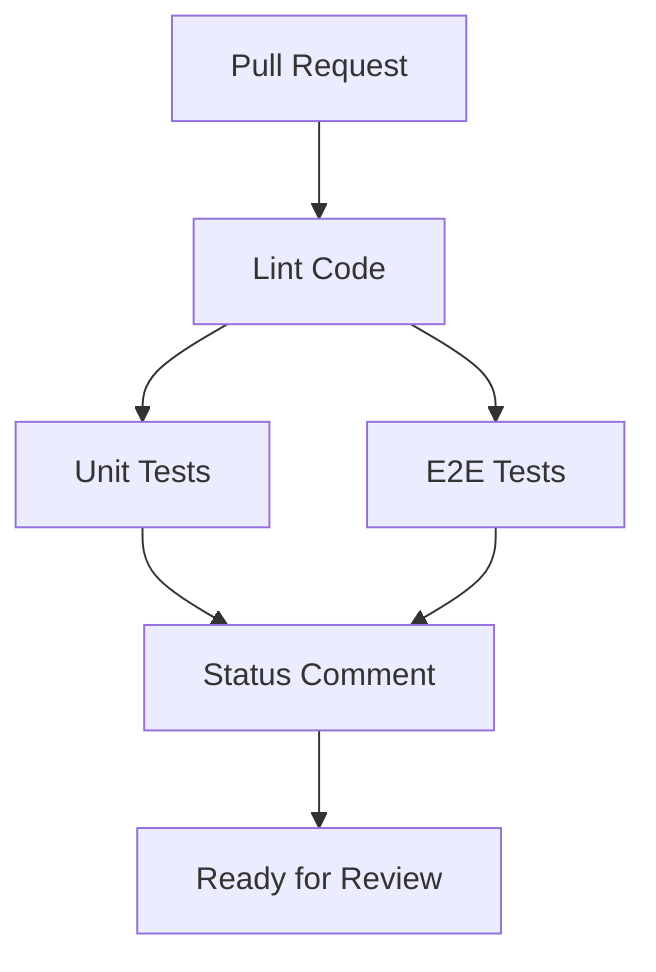

# Pull Request Validation Workflow

## 📋 Overview

The `pull-request.yml` workflow validates all pull requests to the `main` branch by running automated quality checks, tests, and posting a status comment.

## 🚀 Workflow Structure



## 🔄 Jobs

### 1. **Lint Code** (5 min timeout)
- **Runs on**: `ubuntu-latest`
- **Purpose**: Validates code quality and style standards
- **Steps**:
  - Checkout code
  - Setup Node.js from `.nvmrc` (v22.14.0)
  - Install dependencies with `npm ci`
  - Run ESLint

### 2. **Unit Tests** (10 min timeout)
- **Runs on**: `ubuntu-latest`
- **Depends on**: Lint job
- **Purpose**: Executes unit tests with coverage reporting
- **Steps**:
  - Checkout code
  - Setup Node.js
  - Install dependencies
  - Run tests with coverage (`npm run test:coverage`)
  - Upload coverage to Codecov (optional)
  - Upload coverage artifacts

**Coverage Artifacts**:
- Name: `unit-test-coverage`
- Path: `coverage/`
- Retention: 7 days

### 3. **E2E Tests** (15 min timeout)
- **Runs on**: `ubuntu-latest`
- **Depends on**: Lint job
- **Environment**: `integration`
- **Purpose**: Executes end-to-end tests using Playwright
- **Steps**:
  - Checkout code
  - Setup Node.js
  - Install dependencies
  - Install Playwright browsers (Chromium only)
  - Build application
  - Run E2E tests
  - Upload Playwright report
  - Upload test results
  - Upload E2E coverage (if available)

**Environment Variables** (from `integration` environment):
- `PUBLIC_SUPABASE_URL` - Supabase project URL (browser-side)
- `PUBLIC_SUPABASE_KEY` - Supabase anon key (browser-side)
- `SUPABASE_URL` - Supabase project URL (server-side)
- `SUPABASE_KEY` - Supabase anon key (server-side)
- `OPENROUTER_API_KEY` - OpenRouter API key (optional)
- `BASE_URL` - Base URL for E2E tests (`http://localhost:3000`)

**Artifacts**:
- `playwright-report-{run_id}` - HTML report with test results
- `test-results-{run_id}` - Raw test results
- `e2e-test-coverage` - Coverage data (optional)

### 4. **Status Comment** (5 min timeout)
- **Runs on**: `ubuntu-latest`
- **Depends on**: Lint, Unit Tests, E2E Tests
- **Condition**: Only runs if all previous jobs succeed
- **Purpose**: Posts a summary comment to the PR
- **Steps**:
  - Checkout code
  - Download all coverage and test artifacts
  - Generate PR comment with test results
  - Create or update existing bot comment

**Comment includes**:
- ✅ Success status
- 📊 Coverage statistics (unit and E2E)
- 🔗 Links to workflow run and Playwright report
- 📦 Build information (commit, branch, run ID)

## 🔐 Required Secrets

Configure these secrets in your repository settings:

### GitHub Repository Secrets

| Secret Name | Required | Description | Where to Get |
|-------------|----------|-------------|--------------|
| `PUBLIC_SUPABASE_URL` | ✅ Yes | Supabase project URL | [Supabase Dashboard](https://supabase.com/dashboard) → Settings → API |
| `PUBLIC_SUPABASE_KEY` | ✅ Yes | Supabase anon/public key | [Supabase Dashboard](https://supabase.com/dashboard) → Settings → API |
| `OPENROUTER_API_KEY` | ❌ Optional | OpenRouter API for AI features | [OpenRouter Keys](https://openrouter.ai/keys) |
| `CODECOV_TOKEN` | ❌ Optional | Codecov upload token | [Codecov](https://codecov.io) (for private repos) |

### GitHub Environment: `integration`

Create an environment named `integration` with the same secrets as above. This provides an additional layer of configuration for E2E tests.

**To create the environment**:
1. Go to: Repository → Settings → Environments
2. Click "New environment"
3. Name it `integration`
4. Add the required secrets

## 🎯 Triggers

The workflow triggers on:
- **Pull Request** events: `opened`, `synchronize`, `reopened`
- **Target Branch**: `main`

## 🔒 Permissions

The workflow requires these permissions:
- `contents: read` - Read repository files
- `actions: read` - Read workflow information
- `checks: write` - Write check run status
- `pull-requests: write` - Post comments on PRs

## ⚙️ Configuration

### Concurrency
```yaml
concurrency:
  group: ${{ github.workflow }}-${{ github.event.pull_request.number }}
  cancel-in-progress: true
```
This ensures only one workflow runs per PR, canceling older runs when new commits are pushed.

### Parallel Execution
Unit tests and E2E tests run in parallel after the lint job passes, reducing total execution time.

## 📊 Action Versions Used

All actions are pinned to the latest major versions:

| Action | Version | Last Checked |
|--------|---------|--------------|
| `actions/checkout` | v5 | Oct 2025 |
| `actions/setup-node` | v6 | Oct 2025 |
| `actions/upload-artifact` | v4 | Oct 2025 |
| `actions/download-artifact` | v5 | Oct 2025 |
| `actions/github-script` | v8 | Oct 2025 |
| `codecov/codecov-action` | v5 | Oct 2025 |

## 🐛 Troubleshooting

### Common Issues

#### E2E Tests Timeout
**Symptoms**: E2E job times out after 15 minutes
**Solution**: 
- Check if Supabase instance is accessible
- Verify environment variables are set correctly
- Check Playwright browser installation

#### Missing Coverage Data
**Symptoms**: Coverage shows as "N/A" in PR comment
**Solution**:
- Ensure `test:coverage` script generates `coverage-summary.json`
- Check vitest configuration includes `json-summary` reporter
- Verify artifacts are uploaded successfully

#### Status Comment Not Posted
**Symptoms**: No comment appears on PR
**Solution**:
- Verify `pull-requests: write` permission is granted
- Check if previous jobs all passed
- Review workflow logs for the status-comment job

#### Invalid Supabase Credentials
**Symptoms**: E2E tests fail with 401/403 errors
**Solution**:
- Use **anon key**, not **service_role key**
- Verify secrets match your Supabase project
- Check if both PUBLIC_ and non-PUBLIC_ variables are set

## 🔄 Updating the Workflow

### Checking for Action Updates
```powershell
# Check latest version of an action
Invoke-RestMethod -Uri "https://api.github.com/repos/{owner}/{repo}/releases/latest" | 
  Select-Object -ExpandProperty tag_name

# Check if action is archived
Invoke-RestMethod -Uri "https://api.github.com/repos/{owner}/{repo}" | 
  Select-Object -ExpandProperty archived
```

### Best Practices
1. Always use major version tags (e.g., `v5`, not `v5.0.0`)
2. Review action README for breaking changes
3. Test workflow changes on a feature branch first
4. Keep environment variables in sync with documentation

## 📚 Related Documentation

- [GitHub Actions Documentation](https://docs.github.com/en/actions)
- [Playwright Documentation](https://playwright.dev)
- [Vitest Coverage](https://vitest.dev/guide/coverage.html)
- [Codecov Documentation](https://docs.codecov.com)
- [Main CI Workflow](./README.md)
- [Setup Guide](../SETUP.md)

## 📝 Notes

- The workflow uses Chromium browser only (as per project guidelines)
- Coverage upload to Codecov is optional and won't fail the build
- E2E coverage is optional due to instrumentation complexity
- Node.js version is managed via `.nvmrc` file
- Dependencies are installed using `npm ci` for reproducible builds

