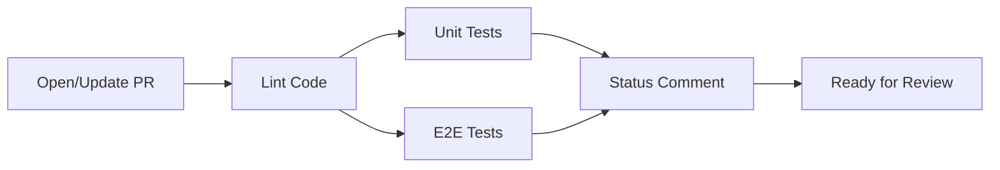

# Pull Request Workflow - Quick Start Guide

## 🚀 5-Minute Setup

### Step 1: Configure GitHub Secrets

Go to: **Repository → Settings → Secrets and variables → Actions**

Add these secrets:

```
PUBLIC_SUPABASE_URL=https://your-project.supabase.co
PUBLIC_SUPABASE_KEY=your-anon-key-here
```

Optional (for AI features):
```
OPENROUTER_API_KEY=your-openrouter-key-here
```

Optional (for coverage upload to Codecov on private repos):
```
CODECOV_TOKEN=your-codecov-token-here
```

**Where to get these values:**
- Supabase: [Dashboard](https://supabase.com/dashboard) → Your Project → Settings → API
- OpenRouter: [Keys](https://openrouter.ai/keys)
- Codecov: [Codecov.io](https://codecov.io) → Your Repository

### Step 2: Create Integration Environment

Go to: **Repository → Settings → Environments**

1. Click **"New environment"**
2. Name: `integration`
3. Click **"Configure environment"**
4. Add the same secrets as Step 1:
   - `PUBLIC_SUPABASE_URL`
   - `PUBLIC_SUPABASE_KEY`
   - `OPENROUTER_API_KEY` (optional)

### Step 3: Test the Workflow

Create a test branch and PR:

```bash
git checkout -b test/pr-workflow
git commit --allow-empty -m "test: Verify PR workflow"
git push origin test/pr-workflow
```

Then create a Pull Request to `main` on GitHub.

### Step 4: Verify It Works

The workflow should:
1. ✅ Run lint check
2. ✅ Run unit tests with coverage
3. ✅ Run E2E tests with Playwright
4. ✅ Post a status comment to your PR

**Expected PR Comment:**

```
## ✅ Pull Request Validation Passed

All checks have completed successfully! 🎉

### 📊 Test Results Summary
| Check | Status | Details |
|-------|--------|---------|
| Linting | ✅ Passed | Code quality standards met |
| Unit Tests | ✅ Passed | Coverage: X% lines, Y% statements |
| E2E Tests | ✅ Passed | Coverage: N/A |

...
```

## 🎯 What Happens on Each PR?



- **Linting** - Validates code quality
- **Unit Tests** - Fast tests with coverage
- **E2E Tests** - Full integration testing
- **Status Comment** - Automated PR summary

## 📊 Workflow Details

| Job | Duration | Runs |
|-----|----------|------|
| Lint | ~1-2 min | First |
| Unit Tests | ~2-4 min | After Lint (parallel) |
| E2E Tests | ~5-10 min | After Lint (parallel) |
| Status Comment | ~30 sec | After all tests pass |

**Total Time:** ~5-10 minutes (thanks to parallel execution)

## 🔧 Troubleshooting

### Workflow doesn't trigger?
- Verify `.github/workflows/pull-request.yml` exists
- Check PR is targeting `main` branch
- Ensure workflow file is committed to your branch

### E2E tests fail?
- Check Supabase secrets are correct
- Verify you're using **anon key**, not **service_role key**
- Review Playwright report in workflow artifacts

### No status comment posted?
- Ensure previous jobs all passed (lint, unit, E2E)
- Check workflow has `pull-requests: write` permission
- Review status-comment job logs

### Coverage shows "N/A"?
- Unit tests should generate `coverage/coverage-summary.json`
- Check `npm run test:coverage` works locally
- E2E coverage is optional and may not be available

## 📚 Full Documentation

For detailed information, see:
- [Pull Request Workflow Documentation](.github/workflows/README-pull-request.md)
- [Implementation Summary](.github/PULL_REQUEST_WORKFLOW_SUMMARY.md)
- [Main CI Workflow](.github/workflows/README.md)

## ✅ Checklist

Before considering setup complete:

- [ ] GitHub secrets configured (`PUBLIC_SUPABASE_URL`, `PUBLIC_SUPABASE_KEY`)
- [ ] Integration environment created with same secrets
- [ ] Test PR created
- [ ] Workflow triggered successfully
- [ ] All jobs completed (lint, unit tests, E2E tests)
- [ ] Status comment posted to PR
- [ ] Coverage data visible in comment
- [ ] Artifacts uploaded (test reports, coverage)

## 🎉 You're Done!

Once the checklist is complete, your repository is fully set up with automated PR validation. Every pull request will now be automatically tested and validated before review.

---

**Questions?** Check the [troubleshooting guide](.github/workflows/README-pull-request.md#-troubleshooting) or review workflow run logs in GitHub Actions.

